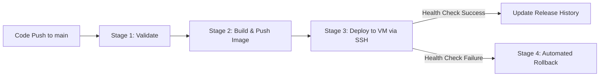

# Rajya (Sovereign Core) — Production VM Deployment Guide

This document details the production containerization, CI/CD pipeline, and VM deployment architecture for **Rajya (Sovereign Core / `text-risk-scoring-service`)**.

---

## 1. Architecture & Container Specifications

- **Container Image:** `bhiv/rajya-core:latest` / `bhiv/rajya-core:<git-sha>`
- **Container Name:** `bhiv_rajya_core`
- **Exposed Host Port:** `8015:8000` (Configurable via `$GATEWAY_PORT`)
- **Base OS:** Python 3.11-slim (Debian base)
- **User:** Non-root (`enforcement`, UID: 1000)
- **Database Dependency:** **Zero local DB** (stateless gateway; persists state & audit traces to Layer 5 Bucket Ledger API)
- **Target VM Directory:** `~/RAJYA`

---

## 2. GitHub Secrets Configuration

To enable automated CI/CD deployment via GitHub Actions, add the following repository secrets under **Settings > Secrets and variables > Actions**:

| Secret Name | Description | Example / Note |
|---|---|---|
| `VM_IP` | Public IP or Hostname of the target VM | `163.128.209.18` |
| `VM_PORT` | SSH Port for VM access | `22` |
| `VM_USERNAME` | SSH User on the VM | `root` or `ubuntu` |
| `VM_PASSWORD` | SSH Password for the VM user | `********` |
| `DOCKER_USERNAME` | Docker Hub Username | `bhiv` |
| `DOCKER_PASSWORD` | Docker Hub Password / Access Token | `dckr_pat_********` |
| `RAJYA_ENV_FILE` (or `ENV_FILE`) | Complete production `.env` contents provided by the team | Multi-line env string |

---

## 3. Automated CI/CD Workflow (`.github/workflows/cicd.yml`)

The automated pipeline executes on every push to `main` (or via manual `workflow_dispatch`):



1. **`validate`**: Validates Docker Compose schema and template generation.
2. **`build`**: Builds the multi-stage Docker image and pushes tags `bhiv/rajya-core:<short_sha>` and `latest` to Docker Hub.
3. **`deploy`**:
   - Connects to the VM via SSH (`sshpass`).
   - Copies `docker-compose.production.template.yml` and `.env` to `~/RAJYA`.
   - Substitutes `IMG_TAG` with the Git SHA.
   - Executes `docker compose pull` and `docker compose up -d --remove-orphans`.
   - Polls `http://localhost:8015/health` for up to 120 seconds.
   - Logs the successful release in `docs/RELEASE_HISTORY.md` and backs it up to `/var/tmp/RAJYA/RELEASE_HISTORY.md`.
4. **`rollback`**:
   - Automatically executes if deployment fails.
   - Reads the previous known stable SHA from `RELEASE_HISTORY.md`.
   - Restores and verifies the previous healthy container on port `8015`.

---

## 4. Manual Deployment on the VM

If you need to manually deploy or debug the service directly on the VM:

```bash
# 1. SSH into the VM and navigate to deployment directory
ssh <user>@<vm-ip>
mkdir -p ~/RAJYA
cd ~/RAJYA

# 2. Add the production .env file
nano .env

# 3. Create active compose file from template (e.g. tag 'latest' or specific SHA)
sed "s|IMG_TAG|latest|g" docker-compose.production.template.yml > docker-compose.production.yml

# 4. Pull image and start the container
docker compose -f docker-compose.production.yml pull
docker compose -f docker-compose.production.yml up -d --remove-orphans

# 5. Check container status & logs
docker compose -f docker-compose.production.yml ps
docker compose -f docker-compose.production.yml logs -f --tail=50
```

---

## 5. Verification & Health Monitoring

Run the verification suite from the repository or VM to validate all core subsystems:

```bash
# 1. Primary Health Probe
curl -f http://localhost:8015/health
# Expected: {"status": "ok", "service": "bhiv-enforcement-gateway"}

# 2. Public JWKS Key Verification
curl -f http://localhost:8015/.well-known/jwks.json

# 3. Comprehensive Automated Verification Script
python scripts/verify_deployment.py --base-url http://localhost:8015
```
