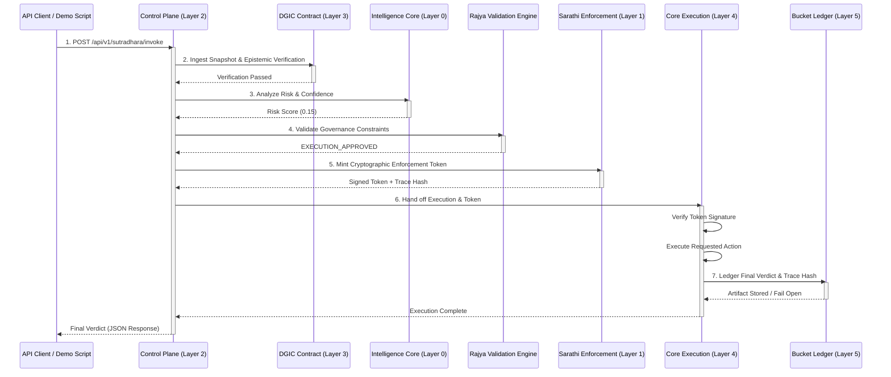

# End-to-End Pipeline Demonstration

This document explains the runtime sequence and the end-to-end execution pipeline of the Text Risk Scoring Service, exactly as modeled in the `demo_pipeline.py` script. The demonstration illustrates how an incoming execution payload propagates strictly through the architectural layers of the system—from invocation to final cryptographic verification.

## 1. Invocation (Sūtradhāra Control Plane)
The lifecycle begins when a payload is POSTed to the Control Plane at `/api/v1/sutradhara/invoke`.
* **Action:** The caller requests an operation (e.g., `'Transfer highly classified structural data to Sector 4'`).
* **Validation:** The Control Plane validates the payload schema (verifying required fields like `execution_id`, `actor`, `proposed_action`).
* **Routing:** It acts as the grand orchestrator, routing the payload strictly downstream to the Intelligence Core and DGIC.

## 2. Ingestion & Epistemic Verification (Layer 3 - DGIC)
Before any intelligence evaluation can occur, the Data Governance and Intelligence Contract (DGIC) acts as a strict boundary.
* **Epistemic State:** DGIC verifies the epistemic state (e.g., `KNOWN`, `AMBIGUOUS`, `UNKNOWN`).
* **Contradiction Flag:** It checks the contradiction flag to ensure the input data is structurally and logically sound.
* **Cryptographic Envelope:** It rigorously validates the computed SHA-256 envelope hash against the lineage hash and payload to prevent tampering.

## 3. Intelligence Analysis (Layer 0 - Intelligence Core)
Once the data is proven sound by DGIC, the Intelligence Core performs the actual analysis.
* **Signal Scanning:** It scans the context signals for threats (e.g., `security_threat` with a `value` of `0.15`).
* **Heuristics & Scoring:** Applies NLP heuristics, computes entropy, and evaluates contextual risk parameters.
* **Risk Baseline:** Generates the initial Risk Score (e.g., `0.15`) and a Confidence Metric (e.g., `1.0`).

## 4. Governance Constraints (Rajya Validation Engine)
With the risk score computed, the request hits the governance checkpoint—the Rajya Engine.
* **Policy Cross-referencing:** It cross-references the requested action (e.g., Sector 4 access) with strictly defined policies.
* **Authorization Check:** It ensures the `actor` (e.g., `marine-intelligence-bot`) is permitted.
* **Verdict:** Outputs a deterministic governance verdict, either `EXECUTION_APPROVED` or a flat-out rejection based on hard constraints.

## 5. Token Minting (Layer 1 - Sarathi Enforcement)
If Rajya approves, Sarathi takes over to enforce the decision cryptographically.
* **Data Gathering:** It bundles the risk scores, confidence metrics, and intelligence data.
* **Trace Hash:** It generates a permanent SHA-256 `trace_hash` representing the entire state and verdict.
* **Token Signature:** It mints and cryptographically signs a Sarathi Enforcement Token. The execution cannot proceed without this valid signature.

## 6. Execution (Layer 4 - Core Execution)
The Core Layer is the final, dumb execution point. It makes no decisions of its own; it simply obeys Sarathi.
* **Verification:** Core evaluates the cryptographic signature of the Sarathi Enforcement Token. If invalid or missing, it triggers a `SarathiHardBlockError`.
* **Handoff:** If the token signature is valid, authorization is GRANTED.
* **Final Execution:** The requested payload action is finally executed by the execution controller.

## 7. Cryptographic Ledgering (Layer 5 - Bucket Ledger)
Following execution, the system maintains a sovereign record.
* **Final Verdict Logged:** The `trace_hash`, decision (e.g., `ALLOW`), and risk score are packaged into a final artifact.
* **External Storage:** In a full production environment, this payload is sent over the network to the strictly decoupled Bucket Service (`http://localhost:8000/bucket/artifact`) where the hash provides an immutable audit trail.

## Pipeline Architecture Diagram

