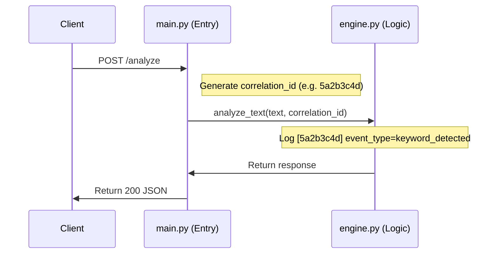

# Observability Specification v2

## 1. Structured Logging Requirement
All logs emitted by the Text Risk Scoring Service must be in **JSON format** to facilitate automated parsing and log aggregation. 

## 2. Event Schema
Standard log entries must include the following fields:
- `timestamp`: ISO 8601 UTC timestamp.
- `level`: Log level (INFO, WARNING, ERROR).
- `correlation_id`: A unique 8-character Trace ID generated for each request.
- `event_type`: A machine-readable event identifier (e.g., `request_received`, `keyword_detected`).
- `message`: Human-readable description.
- `details`: Context-specific key-value pairs.

## 3. Execution Lineage (Trace IDs)
- The `correlation_id` must be generated at the earliest possible entry point (`main.py`).
- This ID must be passed as an argument to downstream components (`engine.py`, `contract_enforcement.py`).
- Every log message associated with a request must include this ID.

## 4. Lineage Visualization

