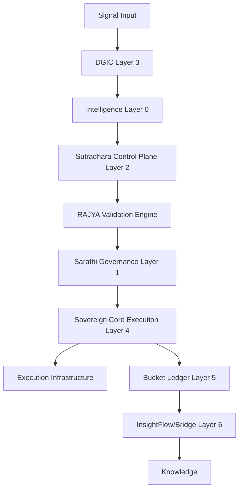
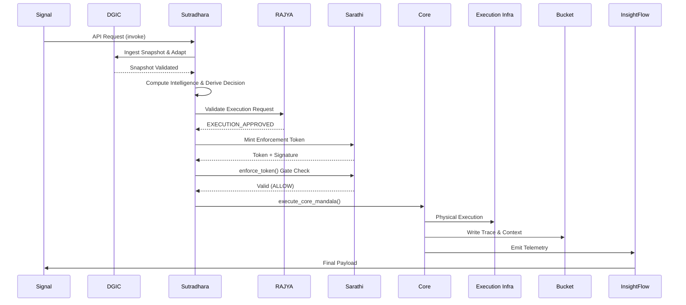
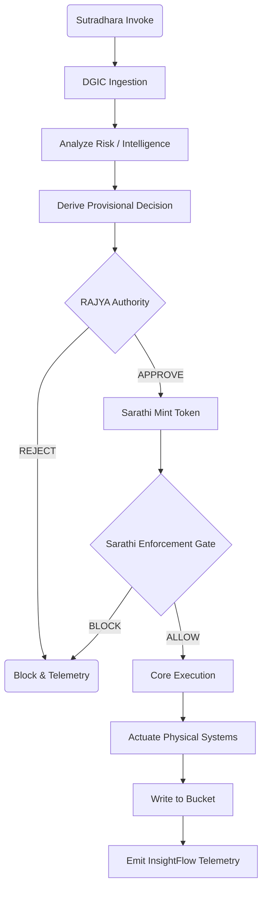
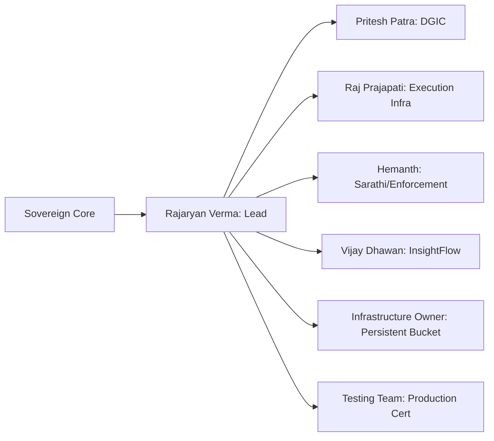

# FULL SOVEREIGN CORE CONVERGENCE PROOF

- **Execution ID**: exec-ph3-3c6f18
- **Final Verdict**: ALLOW
- **Trace Continuity**: Validated. Output trace hash: 43deb788cc6e1071b8c61fd1c898dfd76d401df630b6c803acb97642731e7f2f
- **Convergence**: The call successfully propagated across all required layers with NO simulated or stubbed authority paths.

## Explicit Stub Declarations
As per Phase 1 requirements, the following infrastructure paths are implemented as explicitly declared stubs (pending physical integration in subsequent phases):
1. **Execution Infrastructure** (`app/execution_controller.py`): Logging to standard output instead of triggering downstream physical actuators/services.
2. **Persistent Bucket** (`app/layer5_bucket.py`): In-memory list (`_ledger`) instead of a distributed, immutable database.
3. **Knowledge/InsightFlow Sink** (`app/layer6_insightbridge.py`): Returning telemetry payloads and logging instead of pushing to an external enterprise Knowledge Graph or data warehouse.
4. **Sarathi Cryptography** (`app/layer1_sarathi.py`): Using SHA-256 digests for signatures rather than asymmetric keys (e.g., ECDSA/RSA).
5. **DGIC External Validation** (`app/layer3_dgic.py`): Mocked `_dgic_external_validator` for epistemic envelope integrity checks.

## Phase 1 Convergence Graphs

### 1. Dependency Graph

### 2. Runtime Graph

### 3. Execution Graph

### 4. Ownership Graph

